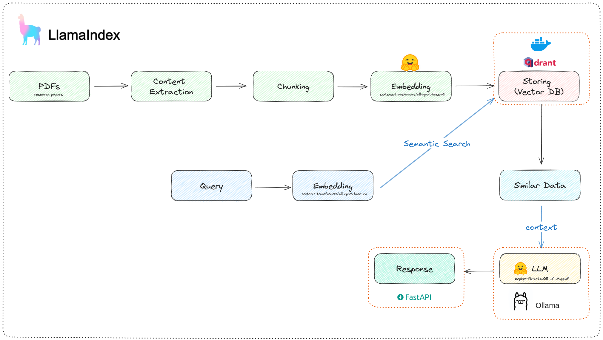
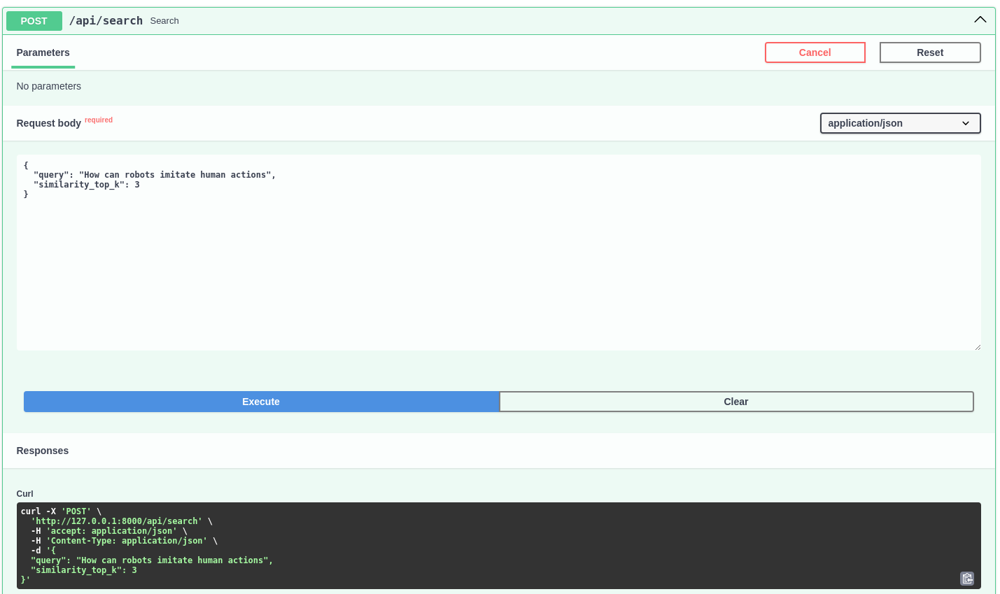
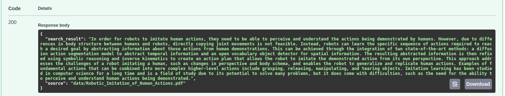

# RAG: Research-assistant


This project aims to help researchers find answers from a set of research papers with the help of a customized RAG pipeline and a powerfull LLM, all offline and free of cost.

For more details, please checkout the [blog post](https://otmaneboughaba.com/posts/local-rag-api) about this project.

## How it works



1. Download some research papers from Arxiv
2. Use Llamaindex to load, chunk, embed and store these documents to a Qdrant database
3. FastAPI endpoint that receives a query/question, searches through our documents and find the best matching chunks
4. Feed these relevant documents into an LLM as a context
5. Generate an easy to understand answer and return it as an API response alongside citing the sources

## Running the project

#### Starting a Qdrant docker instance

```bash
docker run -p 6333:6333 -v ~/qdrant_storage:/qdrant/storage:z qdrant/qdrant
```

#### Downloading & Indexing data

```bash
#Using default directory from config.yml
python rag/data.py

#For a single PDF file:
python rag/data.py -f /path/to/your/file.pdf

#For all PDFs in a directory
python rag/data.py -d /path/to/pdf/directory
```

#### Starting Ollama LLM server


#### Starting the api server

```bash
uvicorn app:app --reload
```


## Example

#### Request



#### Response

